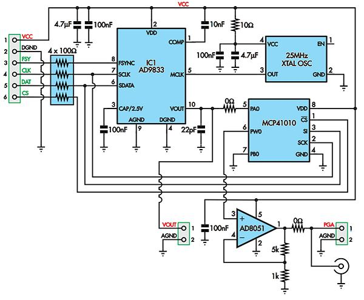

<h1 align = "center">DDS9833</h1>

## ad9833 [library1](https://www.best-microcontroller-projects.com/ad9833.html) 

## ad9833 [library2] (https://github.com/y-x-c/wearable-microphone-jamming/blob/master/jammer_hardware_source/arduino_code/wearable_microphone_jammer/wearable_microphone_jammer.ino)

***

## TTGO ETHERNET BOARD

